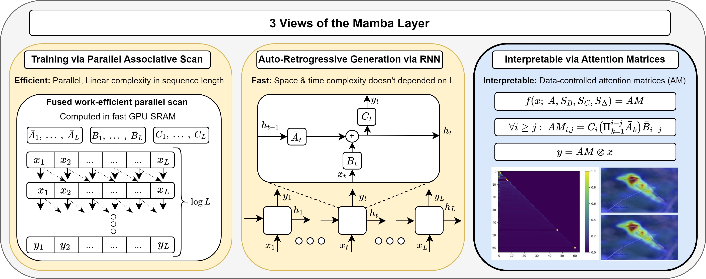
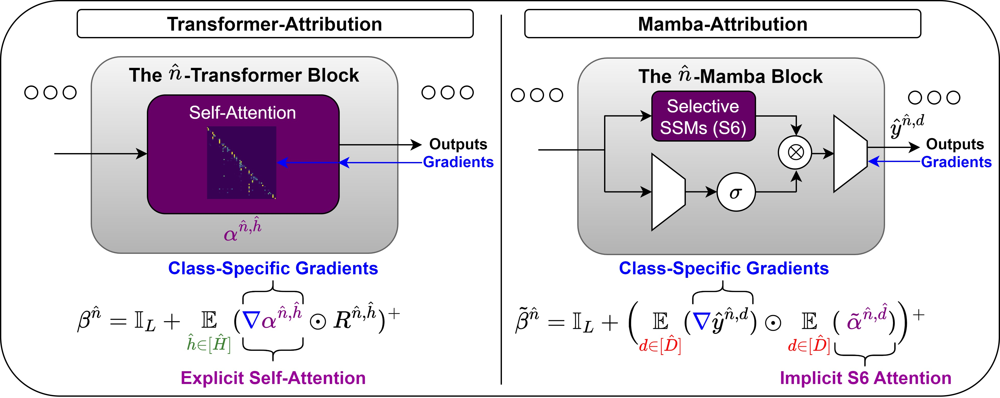
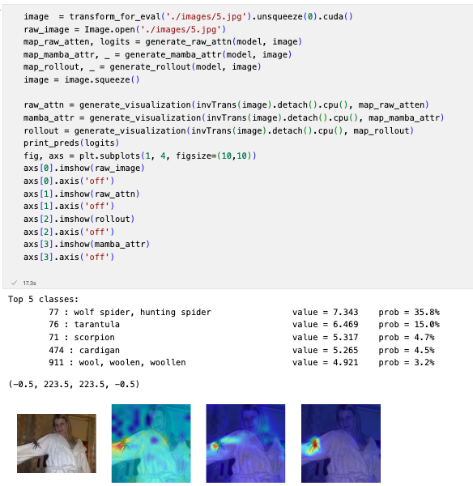

<h3>The Hidden Attention of Mamba Models</h3>

Ameen Ali1 \*,Itamar Zimerman1 \* and Lior Wolf1

1  Tel Aviv University 
(\*) equal contribution

## Official PyTorch Implementation of "The Hidden Attention of Mamba Models"

The Mamba layer offers an efficient state space model (SSM) that is highly effective in modeling multiple domains including long-range sequences and images. SSMs are viewed as dual models, in which one trains in parallel on the entire sequence using convolutions, and deploys in an autoregressive manner. We add a third view and show that such models can be viewed as attention-driven models. This new perspective enables us to compare the underlying mechanisms to that of the self-attention layers in transformers and allows us to peer inside the inner workings of the Mamba model with explainability methods. 

## Set Up Environment

- Python 3.10.13

  - `conda create -n your_env_name python=3.10.13`

- torch 2.1.1 + cu118
  - `pip install torch==2.1.1 torchvision==0.16.1 torchaudio==2.1.1 --index-url https://download.pytorch.org/whl/cu118`

- Requirements: vim_requirements.txt
  - `pip install -r vim/vim_requirements.txt`

- Install ``causal_conv1d`` and ``mamba``
  - `pip install --editable causal_conv1d>=1.1.0`
  - `pip install --editable mamba-1p1p1`
  
  

## Pre-Trained Weights

We have used the offical weights provided by [Vim](https://github.com/hustvl/Vim), which can be downloaded from here:

| Model | #param. | Top-1 Acc. | Top-5 Acc. | Hugginface Repo |
|:------------------------------------------------------------------:|:-------------:|:----------:|:----------:|:----------:|
| [Vim-tiny](https://huggingface.co/hustvl/Vim-tiny-midclstok)    |       7M       |   76.1   | 93.0 | https://huggingface.co/hustvl/Vim-tiny-midclstok |
| [Vim-tiny+](https://huggingface.co/hustvl/Vim-tiny-midclstok)    |       7M       |   78.3   | 94.2 | https://huggingface.co/hustvl/Vim-tiny-midclstok |
| [Vim-small](https://huggingface.co/hustvl/Vim-small-midclstok)    |       26M       |   80.5   | 95.1 | https://huggingface.co/hustvl/Vim-small-midclstok |
| [Vim-small+](https://huggingface.co/hustvl/Vim-small-midclstok)    |       26M       |   81.6   | 95.4 | https://huggingface.co/hustvl/Vim-small-midclstok |

**Notes:**
- <b> In all of our experiments, we have worked with [Vim-small](https://huggingface.co/hustvl/Vim-small-midclstok).</b>

## Vision-Mamba Explainability Notebook:

 
Follow the instructions in <b>vim/vmamba_xai.ipynb</b> notebook, in order to apply a single-image inference for the 3 introduced methods in the paper.
 

## To-Do
<ul>
    <li><input type="checkbox" id="task1" checked disabled><label for="task1">XAI - Single Image Inference Notebook</label></li>
    <li><input type="checkbox" id="task2" disabled><label for="task2">XAI - Segmentation Experimnts</label></li>
    <li><input type="checkbox" id="task3" disabled><label for="task3">XAI - Pertubation Experimnts </label></li>
</ul>

## Acknowledgement
This repository is heavily based on [Vim](https://github.com/hustvl/Vim) and [Transformer-Explainability](https://github.com/hila-chefer/Transformer-Explainability). Thanks for their wonderful works.
